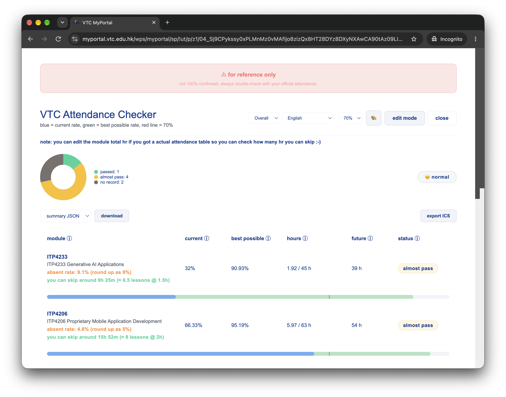

# VTC attendance checker

A browser bookmarklet for checking attendance across VTC modules.

Website: <https://kitzure.github.io/vtc-attendance-checker/>

## How it gets your data

The bookmarklet runs on the VTC page while you are signed in. It uses the browser's existing VTC session, so it reads data for the currently logged-in student and does not send it to a separate server.

1. It finds the VTC Calendar link and fetches the student's scheduled lessons from the VTC calendar API.
2. It opens Profile > Class Attendance in a hidden iframe and reads the module list and attendance form.
3. It submits that form for each module, then reads the returned attendance table: status, arrival time, and lesson duration.
4. It compares attended minutes with scheduled calendar hours and displays current and best-case attendance rates.

The result is shown in a dashboard and saved locally in the browser as `vtc-integrated-data`. The default threshold is 70%.

## Notes

- This repo is 100% vibe-coded. If you have any questions, don't ask me.
- Results are for reference only and are not guaranteed to be 100% accurate.
- The grabber depends on the VTC portal's current links, forms, and page structure.
- Do not refresh or leave the page while it is running.
