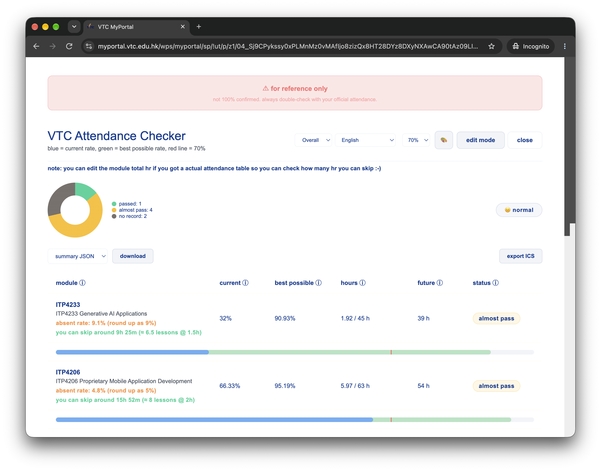

# VTC attendance checker (VTC 出席率checker)

A browser bookmarklet for checking attendance across VTC modules.

Website: <https://kitzure.github.io/vtc-attendance-checker/>

# how does it work?
just go to myportal w/account then bookmark the page and change the link to the javascript and then run it just by pressing the bookmark

## how does the attendance rate is calculated incase you dont know 
### how it grabs your data
* **Schedules:** Pulls scheduled class times and total duration from the VTC calendar.
* **Attendance:** Reads status (`Present`, `Late`, `Absent`), arrival times, and lesson lengths from attendance forms.

### how does it calculate
* **Attended Minutes:** Full duration for `Present`, remaining duration after subtracting late minutes for `Late`, and `0` for `Absent`.
* **Current Rate:** `(Attended Minutes / Past Class Minutes) * 100`
* **Max Rate:** `((Attended Minutes + Future Class Minutes) / Total Scheduled Minutes) * 100`

## notes
* its 100% ai slop, fork if you want to improve it
* not planning to continue fixing it, since it was a small project
